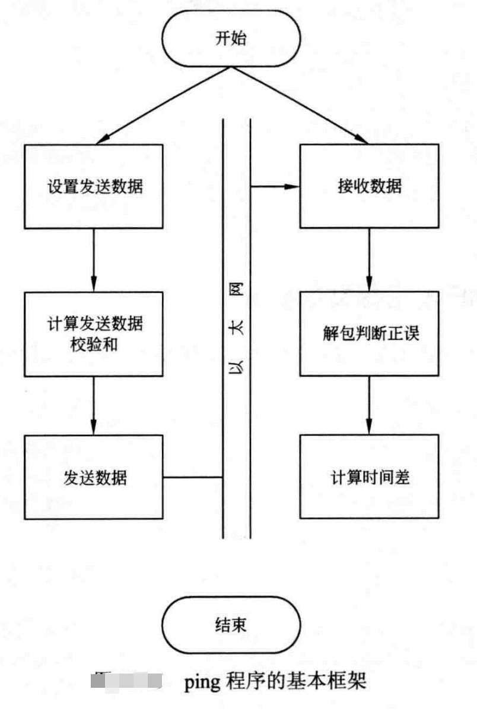
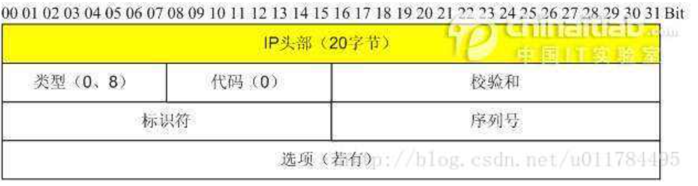
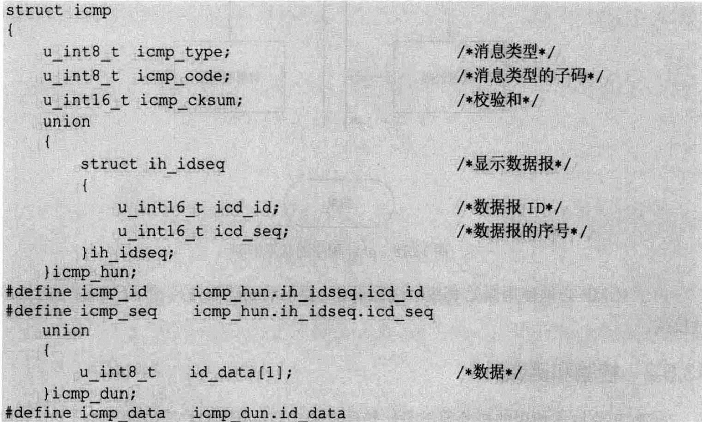

# Ping程序设计

## 0. 设计框架

ping程序一般按照下图的框架进行设计。主要分为

1. 发送数据
2. 接收数据
3. 计算时间差

发送数据对组织好的数据进行发送，接收数据从网络上接收数据并判断其合法性，例如判断是否本进程发出的报文等，计算时间差反应网络的延时。




## 1. 基础如下的知识

### ICMP协议

ICMP协议消息类型有很多种、常见的有如下的几种：

| ICMP消息类型 | 用途说明                                                     |
| ------------ | ------------------------------------------------------------ |
| 回显请求     | Ping工具通过发送ICMP回显消息检查特定节点的IPv4连接以排查网络问题。类型值为0 |
| 回显应答     | 节点发送回显答复消息响应ICMP回显消息。类型值为8              |
| 重定向       | 路由器发送“重定向”消息，告诉发送主机到目标IPv4地址更好的路由。类型值为5 |
| 源抑制       | 路由器发送“源结束”消息，告诉发送主机它们的IPv4数据报将被丢弃——因为路由器上发生了拥塞。于是，发送主机将以较低的频度发送数据报。类型值为4 |
| 超时         | 这个消息有两种用途。第一，当超过IP生存期时向发送系统发出错误信息。第二，如果分段的IP数据报没有在某种期限内重新组合，这个消息将通知发送系统。类型值为11 |
| 无法到达目标 | 路由器和目标主机发送“无法到达目标”消息，通知发送主机它们的数据无法传送。类型值为3 |

其中ping发送数据的时候类型为 **回显请求**  接收数据的时候类型为 **回显应答**

## 2. 发送数据

发送数据对组织好的数据进行发送、送达到目标主机。

具体包含以下的几个部分：

### 1、 ICMP报文填充

ICMP报头的格式设置如下所示:



**各字段说明**

- 类型：占一字节，标识ICMP报文的类型，目前已定义了14种，从类型值来看ICMP报文可以分为两大类。第一类是取值为1~127的差错报文，第2类是取值128以上的信息报文。
- 代码：占一字节，标识对应ICMP报文的代码。它与类型字段一起共同标识了ICMP报文的详细类型。
- **校验和**：这是对**包括ICMP报文数据部分在内的整个ICMP数据报的校验和（数据部分和报头部分）**，以检验报文在传输过程中是否出现了差错。其计算方法与在我们介绍IP报头中的校验和计算方法是一样的。
- 标识：占两字节，用于标识本ICMP进程，但仅适用于回显请求和应答ICMP报文，对于目标不可达ICMP报文和超时ICMP报文等，该字段的值为0。


ping程序请求远程主机所使用的ICMP的类型为**回显请求**

回显请求的报文格式如下：



就是上面所说的**头部（没有选型字段）+ 数据部分**

ICMP回显请求报文的数据填充就是根据上图的格式填写正确的内容

**填充如下：**

- ICMP回显请求的类型为8，即 ICMP ECHO。
- ICMP回显请求的代码值为0。
- ICMP回显请求的校验和后面会讲到
- ICMP回显请求的序列号是一个16位的值，通常由一个递增的值生成。
- ICMP回显请求的ID用于区别，通常用进程的PID填充进行ICMP头部校验的代码如下：
- ICMP回显的数据部分可以任意设置，但是以太网包的总长度不能小于以太网的最小值，即总长度不能小于46.由于IP头部为20字节，ICMP头部为8个字节，以太网头部占用14个字节，因此ICMP回显包的最小值为46-20-8-14=4个字节。


```
/**
 **设置ICMP报文
 * @param icmph 发送的报文
 * @param seq   序列号（依次递增）
 * @param tv    时间戳信息
 * @param length icmp报文(头部+数据部分)总长度
 */
static void icmp_pack(struct icmp *icmph, int seq, struct timeval *tv, int length) {
    unsigned char i = 0;
    /*设置报头*/
    icmph->icmp_type = ICMP_ECHO;    /*ICMP回显请求*/
    icmph->icmp_code = 0;            /*code值为0*/
    icmph->icmp_cksum = 0;      /*先将cksum值填写0，便于之后的cksum计算*/
    icmph->icmp_seq = seq;            /*本报的序列号*/
    icmph->icmp_id = pid & 0xffff;    /*填写PID*/
    for (i = 0; i < length - 8; i++)
        icmph->icmp_data[i] = i;
    /*计算校验和*/
    icmph->icmp_cksum = icmp_cksum((unsigned char *) icmph, length);
}
```


### 2、 ICMP校验

由于ICMP必须使用原始套接字进行设计，要手动设置ICMP的头部校验和。这是对**包括ICMP报文数据部分在内的整个ICMP数据报的校验和（数据部分和报头部分）**，以检验报文在传输过程中是否出现了差错。

```
// 使用校验的部分：（icmp报文填充的时候）
/*计算校验和*/
    icmph->icmp_cksum = icmp_cksum((unsigned char *) icmph, length);


/**
CRC16校验和计算icmp_cksum
参数：
	data:数据
	len:数据长度
返回值：
	计算结果，short类型
*/
static unsigned short icmp_cksum(unsigned char *data, int len) {
    int sum = 0;                            /*计算结果*/
    int odd = len & 0x01;                    /*是否为奇数*/
    /*将数据按照2字节为单位累加起来*/
    while (len & 0xfffe) {
        sum += *(unsigned short *) data;
        data += 2;
        len -= 2;
    }
    /*判断是否为奇数个数据，若ICMP报头为奇数个字节，会剩下最后一字节*/
    if (odd) {
        unsigned short tmp = ((*data) << 8) & 0xff00;
        sum += tmp;
    }
    sum = (sum >> 16) + (sum & 0xffff);    /*高低位相加*/
    sum += (sum >> 16);                    /*将溢出位加入*/

    return ~sum;                            /*返回取反值*/
}
```


### 3、 发送ICMP报文

发送报文函数是一个线程，每隔1s向目的主机发送一个ICMP回显请求报文，它在整个程序处于激活状态（ alive为1）时一直发送报文（alive是一个全局变量）

发送报文的逻辑如下：

1. 获得当前的时间值，按照序列号 packet_send将ICMP报文打包到缓冲区 send buff中后，发送到目的地址。发送成功后，记录发送报文的状态
   - 序号seq为 packet_send
   - 标志fag为1，表示已经发送但是没有收到响应
   - 发送时间为之前获得的时间
2. 每次发送成功后序号值会增加1，即 packet send++。
3. 在线程开始进入主循环 while（ alive）之前，将整个程序的开始发送时间记录下来，用于在程序退出的时候进行全局统计，即 gettimeofday（& ctv begin,NULL），将时间保存在变量 tv_begin中。

```
/*发送ICMP回显请求包*/
static void *icmp_send(void *argv) {
    /*保存程序开始发送数据的时间*/
    gettimeofday(&tv_begin, NULL);
    while (alive) {
        int size = 0;
        struct timeval tv;
        gettimeofday(&tv, NULL);            /*当前包的发送时间*/
        /*在发送包状态数组中找一个空闲位置*/
        pingm_pakcet *packet = icmp_findpacket(-1);
        if (packet) {
            packet->seq = packet_send;        /*设置seq*/
            packet->flag = 1;                /*已经使用*/
            gettimeofday(&packet->tv_begin, NULL);    /*发送时间*/
        }
        // 填充报文数据到发送缓冲区  icmp_pack填充 ICMP响应请求的报头和数据部分
        icmp_pack((struct icmp *) send_buff, packet_send, &tv, 64);
        // 原始套接字 发送 到目标主机
        size = sendto(rawsock, send_buff, 64, 0,        /*发送给目的地址*/
                      (struct sockaddr *) &dest, sizeof(dest));
        if (size < 0) {
            perror("sendto error");
            continue;
        }
        packet_send++;                    /*计数增加*/
        /*每隔1s，发送一个ICMP回显请求包*/
        sleep(1);
    }
}
```

**备注** 

1. 在C语言中可以使用函数gettimeofday()函数来得到精确时间。它的精度可以达到微妙，是C标准库的函数. gettimeofday()会把目前的时间用timeval 结构体返回，当地时区的信息则放到tz所指的结构中

2. timeval 结构体如下

   ```
   struct timeval
   {
     __time_t tv_sec;    /* Seconds.  */
     __suseconds_t tv_usec;   /* Microseconds.  */
   };
   #endif
   ```


## 3. 接收数据

### 1、 剥离ICMP接收报文头部

**函数 icmp_unpack处理来自目标地址的响应应答** icmp_unpack会剥离应答内容IP头部，分析ICMP头部的值。判断是否为正确的ICMP报文，并打印结果。

参数buf为剥去了以太网部分数据的IP数据报文，len为数据长度。可以利用IP头部的参数快速地跳到ICMP报文部分，IP结构的iph标识I头部的长度，由于ih标识的是4字节单位，所以需要乘以4来获得IMP段的地址。

获得ICMP数据段后，判断其类型是否为 ICMP ECHOREPLY，并核实其标识是否为本进程的PID。由于需要判断数据报文的往返时间，在本程序中需要先查找这个包发送时的时间，与当前时间进行计算后，可以得出本地主机与目标主机之间网络ICMP回显报文的差值！


```
/*解压接收到的包，并打印信息*/
static int icmp_unpack(char *buf, int len) {
    int iphdrlen;
    struct ip *ip = NULL;
    struct icmp *icmp = NULL;
    int rtt;

    ip = (struct ip *) buf;                    /*IP头部*/
    iphdrlen = ip->ip_hl * 4;                    /*IP头部长度*/
    icmp = (struct icmp *) (buf + iphdrlen);        /*ICMP段的地址*/
    len -= iphdrlen;
    /*判断长度是否为ICMP包*/
    if (len < 8) {
        printf("ICMP packets\'s length is less than 8\n");
        return -1;
    }
    /*ICMP类型为ICMP_ECHOREPLY并且为本进程的PID*/
    if ((icmp->icmp_type == ICMP_ECHOREPLY) && (icmp->icmp_id == pid)) {
        struct timeval tv_internel, tv_recv, tv_send;
        /*在发送表格中查找已经发送的包，按照seq*/
        pingm_pakcet *packet = icmp_findpacket(icmp->icmp_seq);
        if (packet == NULL)
            return -1;
        packet->flag = 0;    /*取消标志*/
        tv_send = packet->tv_begin;            /*获取本包的发送时间*/
        gettimeofday(&tv_recv, NULL);        /*读取此时间，计算时间差*/
        tv_internel = icmp_tvsub(tv_recv, tv_send);
        rtt = tv_internel.tv_sec * 1000 + tv_internel.tv_usec / 1000;
        /*打印结果，包含
        *  ICMP段长度
        *  源IP地址
        *  包的序列号
        *  TTL
        *  时间差
        */
        printf("%d byte from %s: icmp_seq=%u ttl=%d rtt=%d ms\n",
               len,
               inet_ntoa(ip->ip_src),
               icmp->icmp_seq,
               ip->ip_ttl,
               rtt);

        packet_recv++;                        /*接收包数量加1*/
    } else {
        return -1;
    }
    return 0;
}

// 附上时间计算函数
static struct timeval icmp_tvsub(struct timeval end, struct timeval begin) {
    struct timeval tv;
    /*计算差值*/
    tv.tv_sec = end.tv_sec - begin.tv_sec;
    tv.tv_usec = end.tv_usec - begin.tv_usec;
    /*如果接收时间的usec值小于发送时的usec值，从usec域借位*/
    if (tv.tv_usec < 0) {
        tv.tv_sec--;
        tv.tv_usec += 1000000;
    }

    return tv;
}
```

### 2、 接收数据

接收来自目标地址的响应数据、并且将其送入imcp_packet解包

```
/*接收ping目的主机的回复*/
static void *icmp_recv(void *argv) {
    /*轮询等待时间*/
    struct timeval tv;
    tv.tv_usec = 200;
    tv.tv_sec = 0;
    fd_set readfd;
    /*当没有信号出一直接收数据发*/
    while (alive) {
        int ret = 0;
        FD_ZERO(&readfd);
        FD_SET(rawsock, &readfd);
        ret = select(rawsock + 1, &readfd, NULL, NULL, &tv);
        switch (ret) {
            case -1:
                /*错误发生*/
                break;
            case 0:
                /*超时*/
                break;
            default: {
                /*接收数据*/
                int size = recv(rawsock, recv_buff, sizeof(recv_buff),
                                0);
                if (errno == EINTR) {
                    perror("recvfrom error");
                    continue;
                }
                /*解包，并设置相关变量*/
                ret = icmp_unpack(recv_buff, size);
                if (ret == -1) {
                    continue;
                }
            }
                break;
        }

    }
}
```


## 4. 主程序流程

